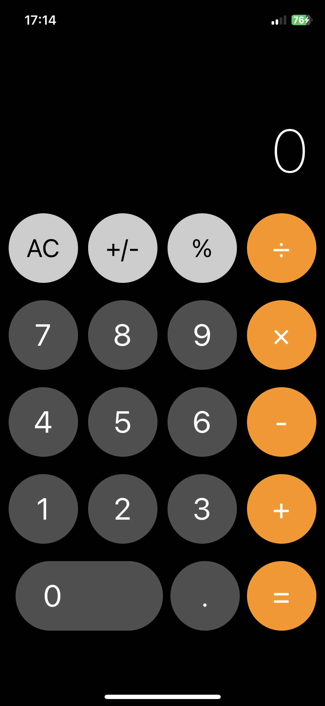
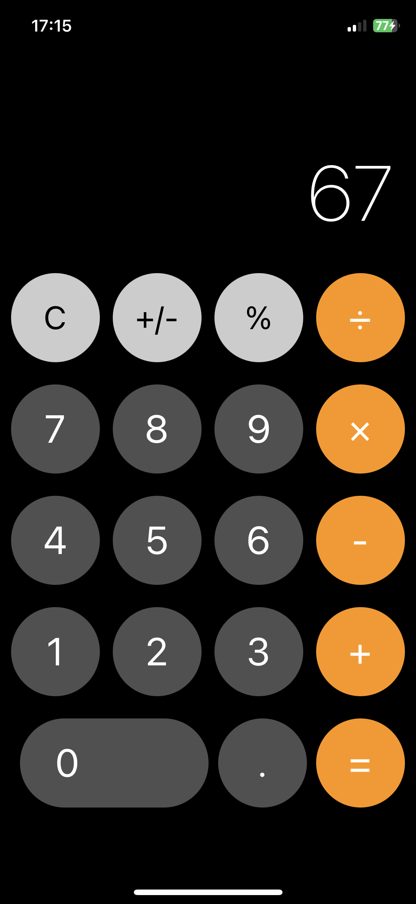
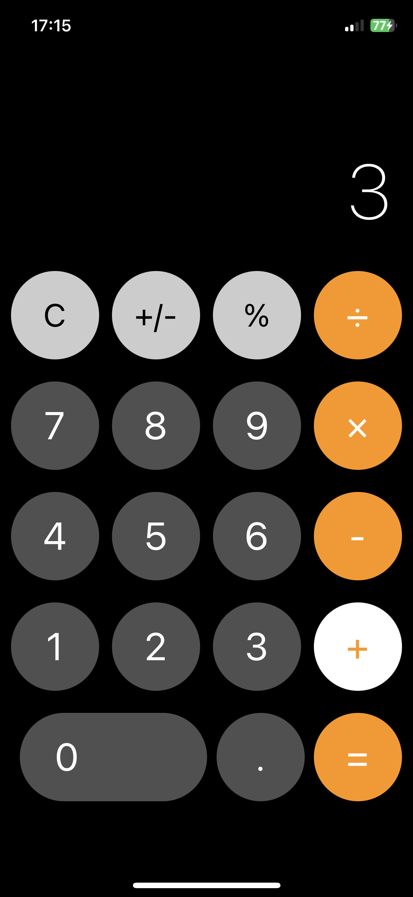

# iOS Calculator Clone 🧮

A pixel-perfect recreation of the iOS Calculator app built with React Native and Expo. This project demonstrates advanced mobile UI development, state management, and mathematical operations handling in a production-quality application.

## 📱 Features

### Core Functionality
- ✅ **Basic Arithmetic Operations**: Addition, subtraction, multiplication, and division
- ✅ **Decimal Support**: Handle decimal numbers with precision
- ✅ **Percentage Calculations**: Convert numbers to percentages instantly
- ✅ **Sign Toggle**: Switch between positive and negative numbers
- ✅ **Chain Calculations**: Perform multiple operations in sequence
- ✅ **Smart Clear Button**: Intelligent AC/C toggle based on calculator state

### UI/UX Features
- 🎨 **Authentic iOS Design**: Faithful reproduction of Apple's calculator interface
- 🔘 **Circular Buttons**: Perfectly rounded buttons with proper touch feedback
- 🟠 **Color-Coded Buttons**: Orange operators, gray functions, dark number pad
- ✨ **Active Operator Highlighting**: Visual feedback for selected operations
- 📏 **Responsive Display**: Auto-sizing text that adapts to number length
- 🌙 **Dark Theme**: Sleek dark interface matching iOS design language

## 🚀 Getting Started

### Prerequisites
- Node.js (v14 or higher)
- npm or yarn
- Expo CLI (optional)
- iOS Simulator (Mac only) or Android Emulator

### Installation

1. Clone the repository
```bash
git clone <your-repo-url>
cd calculator-app
```

2. Install dependencies
```bash
npm install
```

3. Start the development server
```bash
npx expo start
```

4. Run the app
- **iOS Simulator**: Press `i` in the terminal
- **Android Emulator**: Press `a` in the terminal
- **Physical Device**: Scan the QR code with Expo Go app

## 🛠️ Tech Stack

| Technology | Purpose |
|------------|---------|
| **React Native** | Cross-platform mobile framework |
| **Expo** | Development and build toolchain |
| **TypeScript** | Type-safe JavaScript development |
| **React Hooks** | Modern state management (useState) |

## 📂 Project Structure
```
calculator-app/
├── app/
│   ├── index.tsx              # Main calculator component
│   └── _layout.tsx            # App layout configuration
├── assets/
│   ├── fonts/                 # Custom fonts
│   └── images/                # App icons and images
├── node_modules/              # Dependencies
├── .gitignore                 # Git ignore rules
├── app.json                   # Expo configuration
├── package.json               # Project dependencies
├── tsconfig.json              # TypeScript configuration
└── README.md                  # Project documentation
```

## 🧮 How It Works

### State Management
The calculator maintains four key pieces of state:
```typescript
const [display, setDisplay] = useState('0');              // Current display value
const [previousValue, setPreviousValue] = useState(null);  // Stored value for operations
const [operation, setOperation] = useState(null);          // Active operation (+, -, ×, ÷)
const [shouldResetDisplay, setShouldResetDisplay] = useState(false); // Reset flag
```

### Operation Flow
1. **Number Entry**: Numbers are appended to the display
2. **Operation Selection**: Current value is stored, operation is set
3. **Chain Calculations**: When selecting a new operation, previous operation executes first
4. **Equals**: Final calculation is performed and result displayed
5. **Clear**: AC clears everything, C clears only display

### Button Logic
- **Number Buttons (0-9)**: Append digits to display
- **Decimal (.)**: Add decimal point if not already present
- **Operators (+, -, ×, ÷)**: Store current value and set operation
- **Equals (=)**: Calculate and display result
- **Clear (AC/C)**: Reset calculator state
- **Plus/Minus (+/-)**: Toggle number sign
- **Percent (%)**: Divide current value by 100

## 🎨 Design Specifications

### Button Dimensions
- **Standard Buttons**: 80×80 pixels, circular
- **Zero Button**: 170×80 pixels, pill-shaped
- **Spacing**: 10px margin between buttons

### Color Palette
- **Background**: `#000000` (Pure Black)
- **Number Buttons**: `#505050` (Dark Gray)
- **Function Buttons**: `#CCCCCC` (Light Gray)
- **Operator Buttons**: `#FF9500` (Orange)
- **Active Operator**: `#FFFFFF` (White background, orange text)
- **Text**: `#FFFFFF` (White)

### Typography
- **Display**: 70px, font-weight 200
- **Button Text**: 35px
- **Function Text**: 29px, black color

## 🔧 Key Functions

### `handleNumber(num: string)`
Handles number button presses, managing display reset and digit appending.

### `handleOperation(op: string)`
Processes operator selection, executing pending operations and storing values.

### `handleEquals()`
Calculates final result from stored values and operation.

### `calculate(prev: number, current: number, op: string)`
Core calculation function that performs arithmetic operations.

### `handleClear()`
Smart clear function that toggles between AC (All Clear) and C (Clear).

## 🚧 Future Enhancements
- [ ] Add memory functions (M+, M-, MR, MC)
- [ ] Implement scientific calculator mode
- [ ] Add calculation history
- [ ] Support for keyboard input
- [ ] Haptic feedback on button presses
- [ ] Landscape orientation with advanced functions
- [ ] Theme customization options
- [ ] Sound effects

## 📱 Screenshots

<div align="center">
  
  
  
</div>

## 🤝 Contributing
Contributions are welcome! Please feel free to submit a Pull Request.

1. Fork the project
2. Create your feature branch (`git checkout -b feature/AmazingFeature`)
3. Commit your changes (`git commit -m 'Add some AmazingFeature'`)
4. Push to the branch (`git push origin feature/AmazingFeature`)
5. Open a Pull Request

## 📝 License
This project is licensed under the MIT License - see the LICENSE file for details.

## 👨‍💻 Author
Alex
- GitHub: [@alxnca0704-hash](https://github.com/alxnca0704-hash)
- Email: alxnca0704@gmail.commail: alxnca0704@gmail.com

## 🙏 Acknowledgments
- Inspired by Apple's iOS Calculator
- Built with [Expo](https://expo.dev)
- Thanks to the React Native community

## 📚 Learn More
- [Expo Documentation](https://docs.expo.dev/)
- [React Native Documentation](https://reactnative.dev/)
- [TypeScript Documentation](https://www.typescriptlang.org/)
- [React Hooks Guide](https://react.dev/reference/react)

---

Made with ❤️ using React Native and Expo